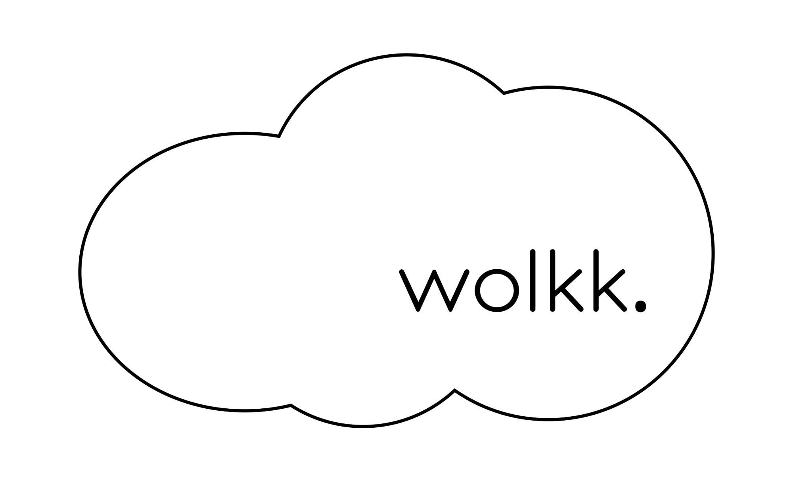

# junior-agent

<p align="center">
  
</p>

Meet Junior: a plugin that turns your coding agent into the engineer everyone wants on their team — careful, curious, and allergic to guessing. Instead of racing to a green checkmark, Junior slows down where it counts: name the task before touching code, reproduce the bug before fixing it, prove the fix against the real thing, and stop and ask before doing anything you can't undo.

Think less "fast intern," more "engineer you'd actually let merge to main." The goal isn't more code — it's less code you can trust.

Two halves that need each other:

- **The project files.** `AGENTS.md` is the agent's memory, the PRD says what, ADRs say why, tests say done.
- **The skills.** How the agent actually works on anything non-trivial: routing, principles, evidence.

It ships as a Claude Code plugin, but it is not Claude-only. The project files are plain Markdown: `AGENTS.md` is read natively by OpenAI Codex CLI and Cursor, and any other tool picks it up through a symlink. Slash-command invocation (`/rigor`, `/architect`) works in Claude Code and in VS Code with GitHub Copilot. In other tools, you reach the same method through `AGENTS.md` section 6b. See [Set up a project](#set-up-a-project) and [Use it in VS Code](#use-it-in-vs-code).

Written so it works for someone who does not code. Section 7 of `AGENTS.md` is strict by default, and the human is the merge authority.

## Contents

- [Install](#install)
- [Set up a project](#set-up-a-project)
- [Use it in VS Code](#use-it-in-vs-code)
- [What is in here](#what-is-in-here)
- [The three rules that make it work](#the-three-rules-that-make-it-work)
- [Why this instead of a bare agent](#why-this-instead-of-a-bare-agent)
- [Does it actually help? (measured)](#does-it-actually-help-measured)
- [Keep it alive](#keep-it-alive)
- [Update an install](#update-an-install)
  - [If you installed the plugin](#if-you-installed-the-plugin)
  - [If you copied the skills by hand](#if-you-copied-the-skills-by-hand)
  - [Updating your `AGENTS.md` and docs](#updating-your-agentsmd-and-docs)
  - [First run, no stamp](#first-run-no-stamp)
  - [Doing it by hand](#doing-it-by-hand)
- [Before you start a project](#before-you-start-a-project)
- [Grow the pack](#grow-the-pack)
- [Powered by Wolkk](#powered-by-wolkk)
- [Credit](#credit)

## Install

Add this repo as a plugin marketplace in Claude Code, then install `junior-agent`. The skills become available as `/rigor`, `/architect`, and so on.

Or copy the skills by hand into any project — this is also the path for Codex CLI, Cursor, Gemini CLI, or any other agent tool:

```bash
mkdir -p .claude/skills && cp -r skills/* .claude/skills/
```

A copy made this way is frozen at the version you copied. Run `/update-pack` later to refresh it — see [Update an install](#update-an-install). Plugin installs update through `/plugin` instead.

The skills work on their own, but they refer to `AGENTS.md` section 7 for permissions. Install the templates too.

## Set up a project

Fastest path: paste the prompt in [`templates/KICKOFF-PROMPT.md`](templates/KICKOFF-PROMPT.md), or run `/setup-project`. The agent detects whether the repo is new or existing, fills the stack and command sections from what is actually there, verifies every command by running it, and stops to ask you at each decision.

By hand, six steps:

1. Copy `templates/AGENTS.md` and `templates/docs/` into your project root.
2. `AGENTS.md` is read natively by OpenAI Codex CLI and Cursor. For any other agent tool you use, symlink its filename: `ln -s AGENTS.md CLAUDE.md` for Claude Code, `ln -s AGENTS.md GEMINI.md` for Gemini CLI.
3. Install the skills (above). The skill-invocation mechanism (`/rigor` and so on) is Claude Code-specific; other tools still get the full method through `AGENTS.md` section 6b, they just can't invoke it as a slash command.
4. Pick a variant from `templates/variants/` and paste its sections over the matching ones in `AGENTS.md`.
5. Fill every `<...>`. If you do not know a value, ask the agent to read the repo and fill it, then review.
6. **Write `docs/prd.md` yourself.** You know the users and the outcome. The agent does not. This is the highest-value thing a non-developer contributes.

New to working this way? Read [`docs/working-with-an-agent.md`](docs/working-with-an-agent.md) first: order of work, prompts worth keeping, warning signs, a two-week checklist.

## Use it in VS Code

Which path you take depends on which agent you run inside VS Code.

**Claude Code extension.** Same plugin, same install. Add the marketplace and install `junior-agent` from the extension's chat; plugins installed with `/plugin` in the terminal show up there too. Every skill works as a slash command.

**GitHub Copilot Chat (agent mode).** Two options:

- *Plugin (preview).* VS Code reads the Claude plugin format. Turn on `chat.plugins.enabled`, then run **Chat: Install Plugin From Source** from the Command Palette and enter `https://github.com/antoniowolkk/junior-agent`. Or add `antoniowolkk/junior-agent` to `chat.plugins.marketplaces`.
- *Copied skills.* Copilot loads skills from `.claude/skills/`, `.github/skills/`, and `.agents/skills/`, so the copy command in [Install](#install) works as-is. Type `/` in chat to see them. Copilot also loads a skill on its own when your request matches the skill's description.

For the project files, you don't need a symlink. Copilot reads `AGENTS.md` and `CLAUDE.md` from the workspace root on its own (settings `chat.useAgentsMdFile` and `chat.useClaudeMdFile`).

**Cursor.** It reads `AGENTS.md` natively. Copy the skills in by hand.

Section 7 of `AGENTS.md` still applies in all three. Copilot's own tool-approval prompts don't replace it.

## What is in here

| Path | What it is |
| --- | --- |
| `skills/rigor/` | The spine. Route the task, apply the principles, prove the result. |
| `skills/descope/` | Whether to build it at all. The ladder, the floor, and a verdict the human signs off on. |
| `skills/delegate/` | How much to take unsupervised, what context to demand, how to prove it. |
| `skills/reproduce/` | Turn a vague defect report into one deterministic failing test. |
| `skills/investigate/` | How does this work, and why is it like this. Read-only, cited. |
| `skills/architect/` | Types, signatures, and boundaries before code. |
| `skills/blast-radius/` | What a change breaks elsewhere, proven by running code. |
| `skills/migrate/` | Schema and data changes as a deploy sequence, with a proven down path. |
| `skills/interrogate/` | Parallel adversarial review, synthesized into one verdict. |
| `skills/swarm/` | Parallel fan-out over slices or competing approaches. |
| `skills/decision-log/` | A reviewable TSV trail for unattended work. |
| `skills/context-engineering/` | Keep the main thread lean: return contracts, targeted reads, compaction at phase boundaries. |
| `skills/ai-eval/` | Accuracy for prompts, agents, RAG, and other non-deterministic AI features: a golden set and a regression gate. |
| `skills/unslop/` | Cut AI tells from anything that ships. |
| `skills/setup-project/` | Install this pack into a repo and fill it from the code. |
| `skills/update-pack/` | Refresh an installed copy without clobbering local edits. Skills replaced, `AGENTS.md` never touched. |
| `skills/grow-skill/` | Research, write, and PR one new skill. You review before anything merges. |
| `templates/AGENTS.md` | The main file. Rules, commands, conventions, guardrails. |
| `templates/variants/` | Platform sections to paste in: frontend, fullstack, backend API, Flutter. |
| `templates/docs/prd.md` | What to build and for whom. **Yours to write.** |
| `templates/docs/adr/` | Decision records. Copy `0000-template.md` per decision. |
| `templates/KICKOFF-PROMPT.md` | The prompt you paste to start. |
| `docs/setup.md` | Detailed setup instructions, written for the agent to read. |
| `docs/working-with-an-agent.md` | How to run a project with an agent when you do not code. |
| `CONTRIBUTING-SKILLS.md` | The contract every skill must satisfy, human- or agent-written. |
| `BACKLOG.md` | The queue `/grow-skill` works from. |
| `LEARNINGS.md` | Plain-language record of every call: what was researched, what it concluded. |
| `scripts/validate-skills.sh` | Mechanical checks on every `SKILL.md`. Run before any skill PR. |
| `scripts/bench/` | Measures whether installing junior changes the outcome on a fixed task, bare vs. junior, graded by a hidden test. Real numbers, not marketing. |
| `example/` | A complete filled-in project to copy the standard from. |

## The three rules that make it work

**Safe.** Section 7 of `AGENTS.md` is strict: the agent stops and asks before anything hard to undo. Deleting, pushing, deploying, touching a database, installing packages, handling secrets. Keep it that way while you are learning. Every skill here is subordinate to it, so where a skill says proceed and section 7 says ask, the agent asks. Nothing irreversible happens without you.

**Rigorous.** `skills/rigor/` is the working method. Name which kind of task this is before acting. Reproduce a bug before fixing it. Name the data shape before writing logic. Prove the result against the real artifact, not a green build. Label every claim as measured, inferred, or guess, so you can tell which parts of an answer were actually checked.

**Powerful.** Section 6, TDD. The agent writes a failing test first, **you review the test**, then it writes code until the test passes. Reviewing a test is far easier than reviewing code: the test states in plain terms what the thing should do. If it says the wrong thing, you catch it before any code exists — while it is still one paragraph instead of four hundred lines. This is the main defense against an agent confidently building the wrong thing.

Two things follow from those rules. **The context survives the session**: `AGENTS.md` holds rules, commands, and conventions, `docs/prd.md` holds the outcome, ADRs hold why a past decision was made, so the agent stops re-deriving the project from scratch and stops re-litigating decisions you already made. And **hard tasks get a named tool instead of a longer prompt**: tracing unfamiliar code, designing a boundary, finding what a change breaks, reviewing adversarially, running work unattended — each is a skill with its own method and output format, so the work is legible afterwards.

**The cost is speed.** This produces less code per hour on purpose. Worth it when the code has to be right and you are the one merging it. Overhead on a throwaway script.

## Why this instead of a bare agent

A stock coding agent optimises for finishing the turn. It will guess a file path, assume a data shape, declare success on a green build, and take an irreversible action because the task implied it. None of that is a bug in the model; it is what "be helpful, quickly" produces. This pack changes the objective.

Against **a bare agent with no project files**, the difference is memory and authority. Conventions and commands live in `AGENTS.md` instead of in a prompt you retype, decisions live in ADRs instead of in a chat you closed, and the permission boundary is written down where every skill can see it rather than negotiated per request.

Against **a big CLAUDE.md of rules**, the difference is routing. Rules in one flat file all compete for attention and quietly stop being applied on long sessions. Here the method is split into skills that load when the task calls for them, so the agent gets the tracing method when it is tracing and the review method when it is reviewing, each at full strength.

Against **agent packs built for speed** (scaffold generators, autonomous PR bots, "ship it" loops), the difference is who holds the merge. Those are built to reduce your involvement. This is built to make your involvement cheap: review a test instead of a diff, read a cited investigation instead of a summary, approve a decision instead of discovering it. You stay the merge authority by design, not by remembering to check.

Against **just being careful in your prompts**, the difference is that care is not a habit here, it is structure. Reproduce-before-fix and prove-against-the-real-thing hold on turn eighty of a long session, when your own attention has gone.

The name is the point. A junior engineer who asks before doing anything permanent, writes the test first, and shows their evidence beats a "senior" one who moves fast and skips all three — every time, on a codebase you actually care about.

## Does it actually help? (measured)

Two synthetic bugs, each planted in a repo with a visible test suite that passes despite the bug. Same one-line prompt run headlessly through the real `claude` CLI, twice: once bare, once with `AGENTS.md` and the skills installed. A hidden test the agent never sees decides pass or fail. 16 runs total (n=8 per condition), `claude-sonnet-5`, 2026-09-23.

| | bare | junior | delta |
| --- | --- | --- | --- |
| success rate | 8/8 | 8/8 | none detected |
| avg wall-clock | 24.0s | 34.2s | +43% |
| avg cost | $0.146 | $0.170 | +17% |
| avg output tokens | 1448 | 2571 | +78% |

Read plainly: no success-rate gap on these two bugs — both were within reach of the bare model on their own. What's real and consistent is the opposite of a flattering number — junior costs more time and tokens per task. That is the trade-off this README already names above: *the cost is speed*. Restating the task, reproducing before fixing, and reporting evidence before declaring done is real work, and it shows up here as real cost, not a hidden discount.

This does not yet measure the pack's actual claim — that a bare agent will guess, declare victory on a green build, or take an irreversible action, and junior won't. Neither injected bug needed that catch; a strong model solved both unaided. See [`scripts/bench/README.md`](scripts/bench/README.md) for the full method, the two tasks, the limitations (small n, one model, one date), and how to run or extend it yourself.

## Keep it alive

`AGENTS.md` is only useful while it is true. When a command changes or a convention shifts, update it in the same change. A stale `AGENTS.md` is worse than none, because the agent will trust it.

## Update an install

A new version of this pack came out. What you do depends on how you installed it, and on which
kind of file you are updating.

**The skills are ours. Your `AGENTS.md` is yours.** `/update-pack` replaces skills and never
writes `AGENTS.md`, `docs/prd.md`, or your ADRs. Those diverge from the templates on purpose —
that divergence is your project.

### If you installed the plugin

Update it through `/plugin`. The plugin system owns those files, and `/update-pack` will stop and
tell you the same thing rather than create a second, divergent copy.

### If you copied the skills by hand

```bash
/update-pack
```

It does this, in order:

1. **Finds the install** and reads `.claude/skills/.junior-agent-version`, the stamp written when
   the skills were copied. The stamp records which commit you copied from — that is the base it
   compares against.
2. **Clones upstream to a temp directory.** Nothing is fetched into your repo and no remote is
   added.
3. **Compares each skill three ways**: the version you copied, the version installed now, and the
   version upstream today. That is what tells a local edit apart from an upstream change.
4. **Shows you a table** before writing anything:

   ```
   skill              verdict             action
   rigor              stale               replace  (upstream: 3 commits, +12/-4 lines)
   reproduce          current             none
   architect          locally modified    keep local
   migrate            conflict            ask
   swarm              new upstream        install?
   our-house-style    unknown to pack     leave alone
   ```

5. **Asks.** One yes covers the safe replacements. Each conflict is asked separately, and keeping
   your version is the default.
6. **Reports template drift.** It lists what changed upstream in `templates/AGENTS.md` and the
   docs since your install, section by section, and hands you the diff. It does not apply any of
   it.
7. **Rewrites the stamp** so the next update has a fresh base.

### Updating your `AGENTS.md` and docs

From step 6 you have a list of upstream template changes. Pick the ones you want, then ask for
them one at a time:

> Apply the section 4 change from that list to my AGENTS.md.

You see the diff, you approve, it writes. There is no bulk apply, and that is deliberate.
Section 7 is your guardrails and sections 1 and 8 are your product — a template pasted over any
of them is a silent safety or accuracy regression that looks exactly like a successful update.

### First run, no stamp

Copies made before the stamp existed have no base, so a local edit and an upstream change are
indistinguishable. `/update-pack` says so and drops into a careful mode: no bulk replace, every
diff shown one at a time, nothing written without a yes. It writes a stamp at the end, so the
second run onward is a real three-way compare.

### Doing it by hand

No agent needed:

```bash
git clone https://github.com/antoniowolkk/junior-agent /tmp/junior-agent
diff -ru .claude/skills /tmp/junior-agent/skills
git -C /tmp/junior-agent diff <the-commit-you-copied>..HEAD -- templates/
```

Read both diffs. Copy the skill files you want. Edit `AGENTS.md` yourself.

## Before you start a project

- [ ] No `<...>` placeholders left
- [ ] Every command in section 4 actually runs
- [ ] `docs/prd.md` filled in by a human
- [ ] Symlink exists for every agent tool in use (`CLAUDE.md`, `GEMINI.md`, ...); not needed for Codex CLI, Cursor, or VS Code Copilot
- [ ] Skills installed and discoverable
- [ ] You can answer: what business outcome does this project create?

## Grow the pack

Say "go learn," or run `/grow-skill`. One call, one topic, researched as deep as it goes, ending in
one draft pull request — a new skill, or a real improvement to an existing one. It never merges.
You are the merge authority, same as everywhere else in this pack.

It reads three sources: the gaps between the skills already here, outside prior art (read in full,
cross-checked against a second independent source before anything is written from it), and
recurring friction in *this pack's own* past sessions — never another project, never another
installed tool.

The guardrails are structural, not promises:

- [`BACKLOG.md`](BACKLOG.md) is the queue. The agent proposes rows; only a human promotes one to
  the top.
- [`CONTRIBUTING-SKILLS.md`](CONTRIBUTING-SKILLS.md) is the contract, including the exact paths an
  agent-authored PR may touch.
- `./scripts/validate-skills.sh` fails the run before a PR exists if the frontmatter, naming,
  links, or README row are wrong.
- One skill per PR, opened as a draft, labelled `agent-authored`.
- It stops before any research once six agent-authored pull requests are already open, and once
  the pack hits twenty skills only improving an existing one is left to do.
- Every call appends one entry to [`LEARNINGS.md`](LEARNINGS.md) before it does anything else —
  what it looked into and what it concluded, in plain language, self-contained in the same commit
  so it never depends on a follow-up push. Read that file to catch up on the pack without reading
  a single PR.

Run it on demand, deliberately, whenever you want the pack to spend a real research cycle on
something:

```bash
/grow-skill
```

or just say **go learn**.

## Powered by Wolkk

<p align="center">
  
</p>

[Wolkk](https://wolkk.com) is a software studio building AI-powered tools and custom software for businesses. Junior is powered by Wolkk: the routing, principles, and evidence-based verification behind every skill in this pack come out of Wolkk's own engineering practice, packaged so any team can run it.

Need something built? Wolkk designs and ships production software, from AI agents to full products, end to end.

<p align="center">
  <a href="https://wolkk.com"></a>
  <a href="mailto:info@wolkk.com"></a>
  <a href="https://www.linkedin.com/company/wolkk/"></a>
</p>

## Credit

The method is adapted from [pstack](https://github.com/cursor/plugins/tree/main/pstack) by poteto (Lauren Tan), MIT licensed, condensed and rewritten for Claude Code. The `AGENTS.md` / PRD / ADR structure comes from the "Agentic AI in the SDLC" workshop. See [`NOTICE`](NOTICE).

MIT licensed. Fork it, improve it, make it yours.
